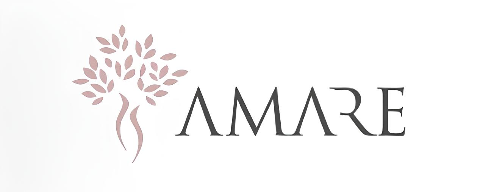

<p align="center">
  
</p>

# Clinica AMARE


Base de MVP para uma plataforma digital de fertilidade com foco em clareza, acolhimento e baixa carga cognitiva.

## O que ja esta implementado

- Monolito Django com areas web para paciente e medico
- API REST em `/api/v1` com DRF
- Apps separados: `users`, `treatments`, `appointments`, `medications`, `assistant`, `core`
- Login por sessao, redirecionamento por papel e perfil basico
- Timeline de tratamento com regras de consistencia
- Agenda cronologica de consultas e exames
- Medicacoes por dose agendada com confirmacao unica por ciclo
- Maya com conversas guiadas, fallback educativo e integracao opcional com LLM
- Dados demo via comando de seed
- Testes para permissoes e fluxos criticos

## Stack

- Backend: Django 6
- API: Django REST Framework
- Banco: PostgreSQL por variaveis de ambiente, com SQLite como fallback local
- Frontend: Django Templates + HTMX + Alpine.js + Tailwind CSS

## Estrutura

```text
config/
core/
users/
treatments/
appointments/
medications/
assistant/
templates/
static/
assets/
docs/
```

## Principais rotas web

- `/login/`
- `/dashboard/`
- `/treatment/`
- `/routine/appointments/`
- `/routine/medications/`
- `/maya/`
- `/maya/treatment/`
- `/maya/routine/`
- `/maya/feelings/`
- `/profile/`
- `/doctor/patients/`
- `/doctor/patients/<id>/`

## Principais endpoints API

- `POST /api/v1/auth/login`
- `POST /api/v1/auth/logout`
- `GET /api/v1/auth/me`
- `POST /api/v1/auth/password-reset-request`
- `GET /api/v1/dashboard`
- `GET /api/v1/treatments/current`
- `GET /api/v1/appointments`
- `GET /api/v1/medications`
- `POST /api/v1/medications/<id>/complete`
- `GET /api/v1/assistant/conversations`
- `GET|POST /api/v1/assistant/interactions`
- `GET /api/v1/doctor/patients`
- `GET /api/v1/doctor/patients/<id>`
- `POST /api/v1/doctor/treatments/<treatment_id>/steps/<step_id>/start`
- `POST /api/v1/doctor/treatments/<treatment_id>/steps/<step_id>/complete`

## Setup local

1. Crie e ative o ambiente virtual.
2. Instale dependencias Python:
   `pip install -r requirements.txt`
3. Instale o frontend:
   `npm install`
4. Copie `.env.example` para `.env` e ajuste se quiser usar PostgreSQL ou LLM.
5. Rode as migracoes:
   `python manage.py migrate`
6. Gere o CSS:
   `npm run build:css`
7. Popule dados demo:
   `python manage.py seed_amare_demo`
8. Inicie o servidor:
   `python manage.py runserver`

## Dados demo

O comando `seed_amare_demo` cria:

- 1 medica responsavel
- 3 pacientes com estados diferentes de jornada
- timeline plausivel de fertilidade
- compromissos futuros e passados
- doses agendadas para hoje e amanha
- historico curto da Maya em conversas guiadas

Senha padrao dos usuarios demo: `amare123!`

## Maya

- Organiza a experiencia em tres conversas guiadas:
  - `Meu tratamento`
  - `Minha rotina`
  - `Como estou me sentindo`
- Classifica cada pergunta por intencao e risco antes de responder
- Usa respostas educativas, acolhedoras e com baixa carga cognitiva
- Mantem historico separado por conversa para a paciente nao se perder
- Se `OPENAI_API_KEY` e `OPENAI_MODEL` estiverem definidos, tenta responder via API antes do fallback
- Perguntas com sintomas, urgencia ou decisao clinica sao redirecionadas para a equipe medica

## Documentacao complementar

- [Arquitetura](docs/architecture.md)
- [UX e Design Tokens](docs/ux.md)
