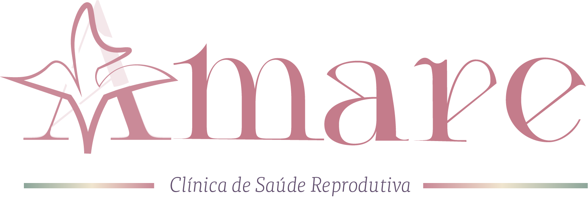

  

# Clínica AMARE

Plataforma de acompanhamento da jornada de fertilidade para pacientes, acompanhantes e equipe médica.

## Integrantes

- Maria Clara Sampaio — `mcsm@cesar.school`
- Marcelo Fonseca — `maf@cesar.school`
- Vinicius Cezar — `vcrc@cesar.school`
- Maria Yvna Tavares — `mytra@cesar.school`
- Pedro Coutinho — `pcs4@cesar.school`
- Mateus Reinaux — `mrbm@cesar.school`
- Guilherme Lindemberg — `gllb@cesar.school`
- Luiz Vieira — `lhcv@cesar.school`
- Eduardo Esteves — `eea@cesar.school`
- Arthur Queiroz — `aqs@cesar.school`
- Guilherme Baltar — `gcb@cesar.school`

## Links Principais

- [Quadro e backlog no Jira](https://amareatlas.atlassian.net/jira/software/projects/SCRUM/boards/1/backlog?atlOrigin=eyJpIjoiNmRmNTk3YjE2ZWUzNDYxZWI1NzAzN2UzNjU2MjU4ZDUiLCJwIjoiaiJ9)
- [Protótipo Lo-Fi no Figma](https://www.figma.com/design/bJ9MX9WeR8haKYAh5MPCZA/LO-fi-AMARE?node-id=61-343&t=Z4pjQUTJStwCSW37-1)
- [Documento das histórias](https://docs.google.com/document/d/1Z7tOHnQnHAWp8qSUGCK6GjeTYqohZI3kN0sLbOmQRzI/edit?usp=sharing)
- [Sistema em produção](https://atlas-amare.onrender.com)
- [Screencast do sistema completo](https://youtu.be/vqWH5peDPlg?si=qoob2ue8Y7QYGWbq)

  
<strong>Quadro de sprints dos épicos</strong>

  - [Abrir quadro no Jira](https://amareatlas.atlassian.net/jira/software/projects/SCRUM/boards/1/backlog?atlOrigin=eyJpIjoiNmRmNTk3YjE2ZWUzNDYxZWI1NzAzN2UzNjU2MjU4ZDUiLCJwIjoiaiJ9)
  - Épicos organizados por fluxo da plataforma:
    - Compreender o tratamento
    - Organizar rotina
    - Receber suporte da Maya
    - Acompanhar paciente
    - Gerenciar jornada médica

## Entrega 01 — Histórias e Protótipos

- Histórias de usuário com cenários de validação BDD.
- Backlog e quadro da Sprint no Jira.
- Protótipos de baixa fidelidade no Figma.
- Screencast do protótipo: **link pendente**.

## Entrega 02 — Primeiras Histórias e Deploy

- Implementação da jornada, rotina e assistente Maya da paciente.
- Adaptação da identidade visual e dos layouts da plataforma.
- Versionamento, acompanhamento de Issues e deploy em produção.

## Entrega 03 — Novas Histórias e Testes E2E

- Implementação das áreas da médica e do acompanhante.
- Testes automatizados das funcionalidades dos diferentes perfis.
- [Screencast da execução dos testes E2E](https://youtu.be/jjoOCNcgriI?is=9TmetjJp4pc4S80G)

## Entrega 04 — Histórias Finais e CI/CD

- Criação do acesso de acompanhante pela médica.
- Refinamento da landing page e dos canais de contato.
- Pipeline de integração contínua com execução automática dos testes.
- Deploy contínuo pela branch `main`.
- [Screencast do processo de CI/CD](https://youtu.be/K2j--gXw9bA?is=7jtGagkUcvDJQ3gg)
